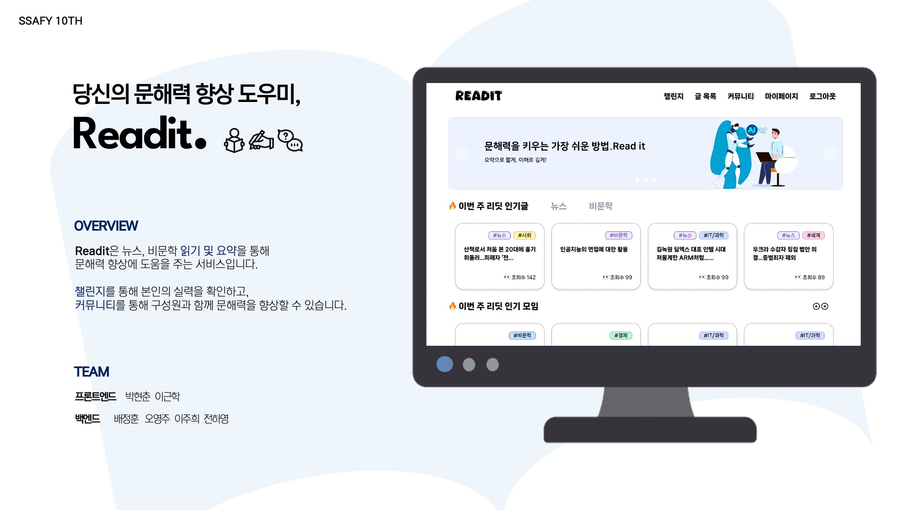
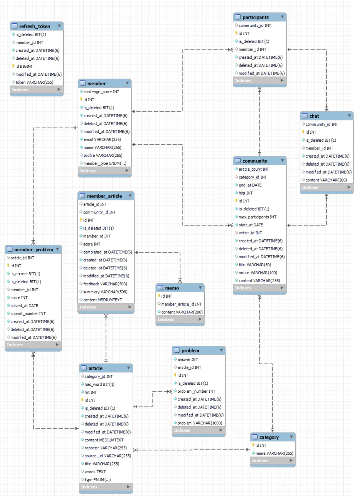

# READIT

# 목차

1. [개요](#1-개요)
2. [개발 환경](#2-개발-환경)
3. [주요 서비스 화면](#3-주요-서비스-화면)
4. [ERD](#4-ERD)
5. [아키텍처](#5-아키텍처)
6. [팀원 소개](#6-팀원-소개)

# 1. 개요

## 프로젝트 소개

- Readit은 뉴스,비문학 읽기 및 요약을 통해 문해력 향상에 도움을 주는 서비스입니다.
- 챌린지를 통해 본인의 실력을 확인하고, 커뮤니티를 통해 함께 문해력을 향상할 수있습니다.

# 2. 개발 환경

### Management Tool

### IDE

### Infra

### Frontend

### Backend

# 3. 주요 서비스 화면

### 글 목록

- 카테고리별 글 목록
- 원하는 네이버 뉴스 링크로 불러오기

### 글 읽기

**뷰어**

- 글 읽기
- 하이라이트
- 단어 검색
- 메모 작성
- 요약 작성

**요약 평가**

- 점수, 피드백 확인

### 챌린지

- 매일 하나의 글을 읽고 퀴즈 풀기
- 랭킹, 점수 통계 확인

### 커뮤니티

- 함께 글을 읽을 수 있는 커뮤니티 생성 또는 참여
- 채팅 기능
- 구성원이 읽은 글, 요약 확인 가능

# 4. ERD

# 5. 아키텍처

# 6. 팀원 소개

-   박현춘 : 팀장, 프론트엔드 담당
-   배정훈 : 백엔드, 인프라 담당
-   오영주 : 백엔드 담당
-   이근학 : 프론트엔드 담당
-   이주희 : 백엔드 담당
-   전하영 : 백엔드, 인프라 담당
