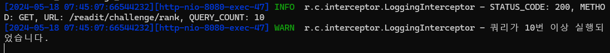

# [BE] 쿼리문 성능 개선

## 기존 문제점

기존의 `getChallengeRank` 메서드는 다음과 같은 방식으로 동작했습니다

```java
@Transactional(readOnly = true)
public GetChallengeRankResponse getChallengeRank(Integer memberId) {

        List<GetRankMember> memberList = memberRepository.findTop7ByOrderByChallengeScoreDesc().stream()
        .map(member -> GetRankMember.of(member.getName(), member.getProfile(), member.getChallengeScore(),
        memberRepository.countPlayersWithHigherScore(member.getChallengeScore()).orElseThrow() + 1))
        .toList();

        int myScore = memberRepository.getById(memberId).getChallengeScore();
        int myRank = memberRepository.countPlayersWithHigherScore(myScore).orElseThrow() + 1;

        return new GetChallengeRankResponse(memberList, myRank);

        }
        
public interface MemberRepository extends JpaRepository<Member, Integer> {
    List<Member> findTop7ByOrderByChallengeScoreDesc();
    @Query("SELECT COUNT(*) FROM Member m WHERE m.challengeScore > :score")
    Optional<Integer> countPlayersWithHigherScore(int score);
}
```

이 방식은 여러 번의 쿼리 호출로 인해 성능에 문제가 있었습니다. 쿼리 카운트가 10개에 달하여 불필요한 데이터베이스 호출이 많았습니다.



## 어떻게 개선할까?
여러 번의 쿼리 호출을 줄이기 위해 RANK() 윈도우 함수를 사용하여 한 번의 쿼리로 상위 7명의 사용자 순위를 조회하는 방식으로 개선할 수 있다는걸 알았고, 이를 통해 쿼리 카운트를 10개에서 1개로 줄여 성능을 개선시키는 과정을 진행하였습니다.
### 개선된 쿼리문
```sql
SELECT 
    m.id, 
    m.name, 
    m.profile, 
    m.challenge_score, 
    RANK() OVER (ORDER BY m.challenge_score DESC) AS `rank`
FROM 
    member m 
ORDER BY 
    m.challenge_score DESC 
LIMIT 7
```
- 쿼리문 설명
  - SELECT: 컬럼(id, name, profile, challenge_score, rank)을 선택
  - RANK() OVER (ORDER BY m.challenge_score DESC): challenge_score 기준으로 순위를 계산
  - FROM member m: member 테이블에서 데이터를 조회
  - ORDER BY m.challenge_score DESC: challenge_score 기준으로 내림차순 정렬
  - LIMIT 7: 상위 7명의 사용자만 조회

## 개선 과정
개선된 getChallengeRank 메서드는 다음과 같습니다:
```java
@Transactional(readOnly = true)
public GetChallengeRankResponse getChallengeRank(Integer memberId) {
        List<Object[]> results = memberRepository.findTop7MembersWithRank();
        AtomicReference<Integer> myRank = new AtomicReference<>(null);

        List<GetRankMember> memberList = results.stream().map(result -> {
        Integer id = (Integer) result[0];
        String name = (String) result[1];
        String profile = (String) result[2];
        Integer challengeScore = (Integer) result[3];
        Integer rank = ((Number) result[4]).intValue();

        if (id.equals(memberId)) {
        myRank.set(rank);
        }

        return GetRankMember.of(name, profile, challengeScore, rank);
        }).toList();

        return new GetChallengeRankResponse(memberList, myRank.get());
        }
```
`MemberRepository` 인터페이스의 수정된 쿼리는 다음과 같습니다:
```java
public interface MemberRepository extends JpaRepository<Member, Integer> {
    @Query(value = "SELECT m.id, m.name, m.profile, m.challenge_score, RANK() OVER (ORDER BY m.challenge_score DESC) AS `rank` " +
            "FROM member m ORDER BY m.challenge_score DESC LIMIT 7", nativeQuery = true)
    List<Object[]> findTop7MembersWithRank();
}
```
# 결과
이러한 최적화를 통해 /rank API의 쿼리 카운트를 10개에서 1개로 줄여 성능을 개선하였습니다. 쿼리 호출이 줄어들면서 데이터베이스 부하가 감소하고, 응답 시간이 빨라졌습니다.

### 개선 전

- 쿼리카운트 : 10 개
### 개선후 

- 쿼리카운트 : 1 개

# 결론
이번 성능 개선 작업을 통해 /rank API의 쿼리 호출 수를 10개에서 1개로 줄이는 데 성공했습니다. 구체적으로, RANK() 윈도우 함수를 활용하여 단일 쿼리로 상위 7명의 사용자와 그들의 순위를 조회하는 방식으로 변경했습니다. 이를 통해 다음과 같은 주요 성과를 얻었습니다.

- 쿼리 카운트 감소: 쿼리 호출 수를 10개에서 1개로 줄여 데이터베이스 부하를 크게 감소시켰습니다.
- 응답 시간 단축: 단일 쿼리로 필요한 모든 데이터를 조회함으로써 API 응답 시간이 빨라졌습니다.
- 코드 간소화: 반복적인 데이터베이스 호출을 제거하고, 서비스 로직을 단순화하여 코드의 가독성과 유지 보수성을 향상시켰습니다.
- 성능 최적화: 데이터베이스 접근이 효율적으로 개선되어 전체 시스템의 성능이 향상되었습니다.

이와 같은 성능 최적화 작업을 통해 시스템의 효율성을 향상시킬 수 있었습니다. 앞으로도 지속적인 모니터링과 최적화를 통해 시스템의 성능을 유지하고 개선해 나갈 예정입니다.
