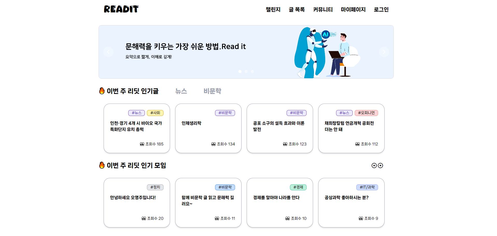

## 💬 프로젝트 소개

문해력을 키우는 가장 쉬운 방법 **READIT** 요약으로 짧게, 이해로 깊게!

## 🙋FE 팀원 소개


<table>
  <tr>
    <td style="padding: 10px;"></td>
    <td style="padding: 10px;"></td>
  </tr>
  <tr>
    <td style="padding: 10px;"><a href="https://github.com/gnaak">이근학</a></td>
    <td style="padding: 10px;"><a href="https://github.com/">박현춘</a></td>
  </tr>
</table>    

## 🛠️기술 스택

- React.js 18.2.0
- Typescript
- Tailwind CSS
- Zustand
- chart.js 
- VSCode

## 🎬실행 방법

```jsx
// 패키지 라이브러리 설치
npm install

// 개발 환경 실행
npm run dev

// 빌드 파일 생성
npm run build
```

> **배포 주소 : https://readit.store**


## 🎮주요 기능

> 1️⃣ 원하는 글 읽기
>
> 뷰어를 사용해 원하는 글을 읽을 수 있습니다.<br>글을 읽으면서 중요한 부분에 형광펜을 칠하고, 메모를 작성할 수 있습니다.<br>임시 저장을 통해 나중에 다시 수정 및 제출할 수 있습니다.

> 2️⃣ 요약 점수 받기
>
> 본인이 작성한 요약에 대한 점수를 받아볼 수 있습니다.

> 3️⃣ 커뮤니티
>
> 본인에 선호하는 글 카테고리와 횟수를 통해 커뮤니티에 가입할 수 있습니다.<br>커뮤니티에서 같은 그룹원이 작성한 요약과 본인의 글을 비교해 보세요.<br>채팅과 공지를 통해 소속감을 느껴보세요.

> 4️⃣ 챌린지
>
> 하루에 한번, 비문학 2문제를 통해 본인의 문해력 향상에 도전해보세요.<br>사용자들의 점수와 본인의 점수를 비교해보면서 성장하는 재미를 느낄 수 있어요.

> 5️⃣ 마이페이지
> 
> 마이페이지에서 내가 읽은 글에 대한 점수와 챌린지 점수를 확인할 수 있습니다.<br>내가 읽은 글에서 내 요약과 메모, 피드백을 확인하고 읽고 있는 글을 통해 임시 저장된 글들을 계속 작성할 수 있습니다.


### 📄 페이지 
<table>
  <tr>
    <td style="padding: 10px;">메인 페이지</td>
    <td style="padding: 10px;">로그인</td>
  </tr>
  <tr>
    <td style="padding: 10px;"></td>
    <td style="padding: 10px;"></td>
  </tr>
</table>
<table>
  <tr>
    <td style="padding: 10px;">챌린지 페이지</td>
  </tr>
  <tr>
    <td style="padding: 10px;"></td>
  </tr>
</table>
<table>
  <tr>
    <td style="padding: 10px;">글 목록 페이지</td>
  </tr>
  <tr>
    <td style="padding: 10px;"></td>
  </tr>
</table>
<table>
  <tr>
    <td style="padding: 10px;">뷰어 페이지</td>
    <td style="padding: 10px;">뷰어 체점</td>
  </tr>
  <tr>
    <td style="padding: 10px;"></td>
    <td style="padding: 10px;"></td>
  </tr>
</table>
<table>
  <tr>
    <td style="padding: 10px;">커뮤니티 페이지</td>
    <td style="padding: 10px;">커뮤니티 상세</td>
  </tr>
  <tr>
    <td style="padding: 10px;"></td>
    <td style="padding: 10px;"></td>
  </tr>
</table>
<table>
  <tr>
    <td style="padding: 10px;">마이 페이지</td>
  </tr>
</table>

 

  - 📁 폴더 구조

  ```
  .

  ├── src
  │   ├── assets
  │   ├── components
  │   ├── containers
  │   ├── hooks
  │   ├── store
  │   └── types
  │   
  └── README.md
  ```
